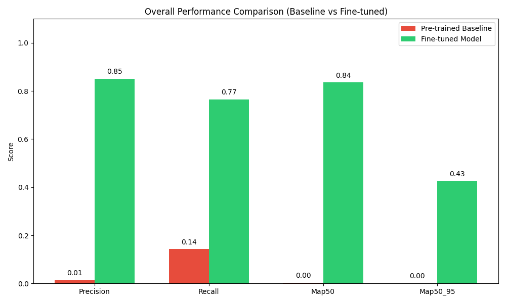
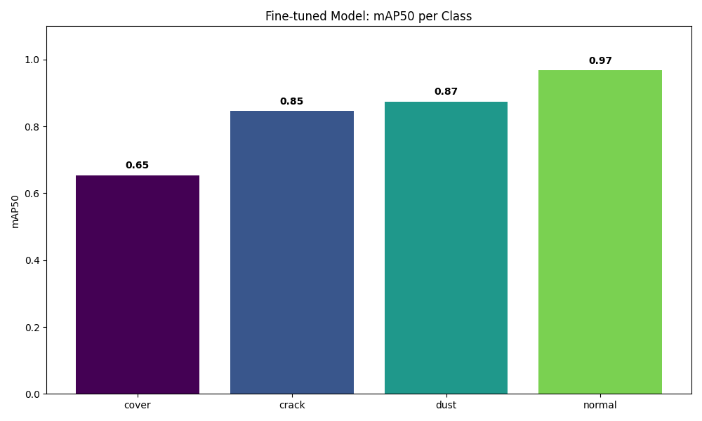
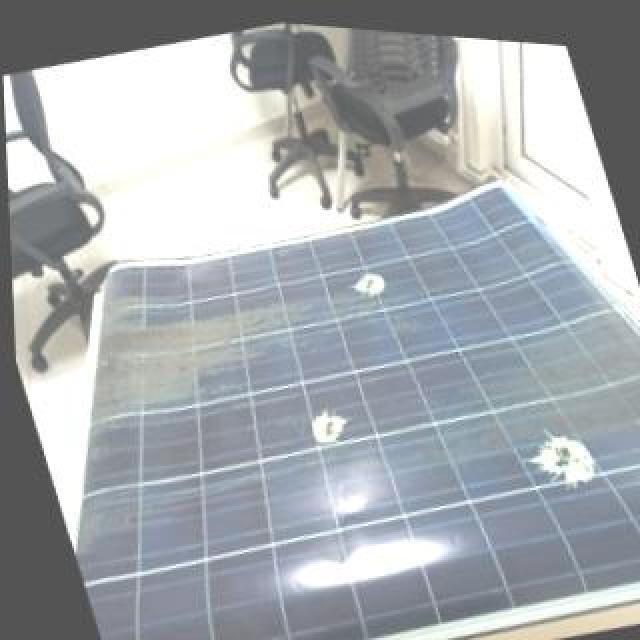
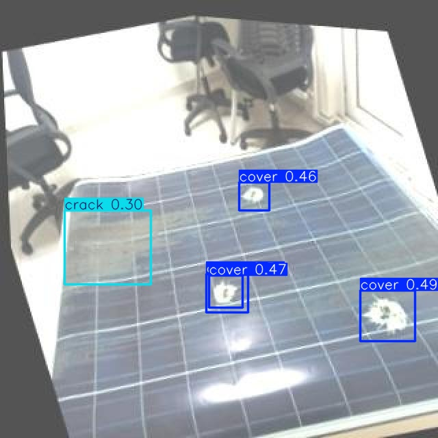
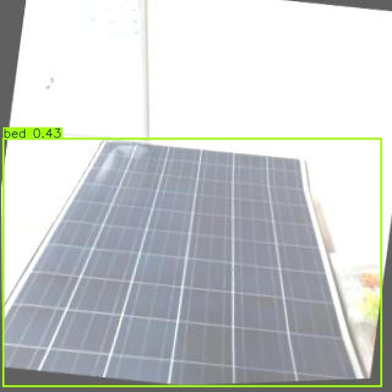
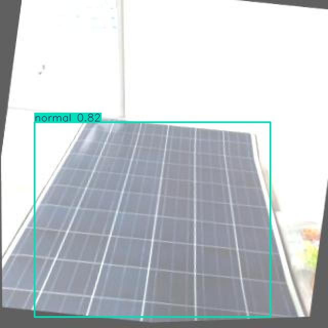
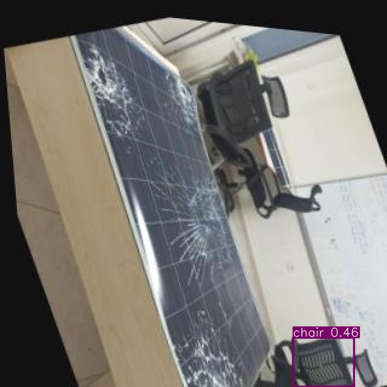
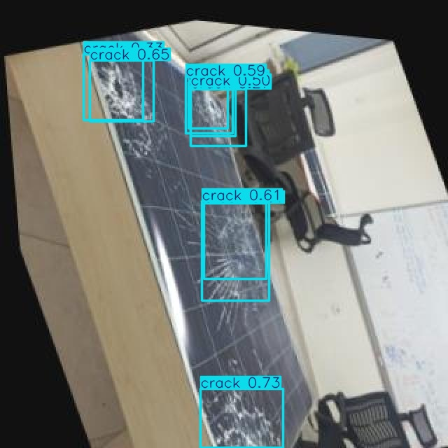

# YOLO
The goal of this assignment is to implement a complete object detection pipeline that:
+ runs inference with a pre-trained YOLO model
+ visualizes and analyzes the detections (bounding boxes, class labels, confidence, scores)
+ fine-tunes (transfer learning) the YOLO model on a custom annotated dataset
+ and evaluates and compares detection performance before and after fine-tuning using standard metrics


## Project Structure
```text
src/
    config.py               # Settings
    dataset.py              # Data Pipeline: Downloads and filters the Dataset
    main.py                 # Manages the whole pipeline 
    model.py                # model
    model_trainer.py        # trains the model
    evalutaion.py           # Performs evalutaion
    utils.py                # utility functions
---
dataset/                    # Image source files
model/                      # trained model
output/                     # Saved plots, inferred data and evaluation results
results/                    # Results to display in README
```

## Getting Started

### Prerequisites: Set up Roboflow API Key

This project downloads datasets from Roboflow. You need to set up the `ROBOFLOW_API_KEY` environment variable:

**Windows PowerShell (current session only):**
```powershell
$env:ROBOFLOW_API_KEY="your_key_here"
```

Then restart your terminal.

**Linux/macOS:**
```bash
export ROBOFLOW_API_KEY='your_key_here'
```

Get your free API key at: https://app.roboflow.com/settings/api

### 1. Installation

Run
```bash
pip install -r requirements.txt
```
to install neccessary requirements.

### 2. Run the pipeline

To reproduce the results, run the pipeline:

```bash
cd src/
python main.py
```

#### Available arguments

You can control different stages of the pipeline using the following flags:

```bash
python main.py [OPTIONS]
```

| Flag | Long option                 | Description                                                                                  |
|------|-----------------------------|----------------------------------------------------------------------------------------------|
| `-i` | `--inference`               | Run inference (used for both pre- and post-training )                                        |
|      | `--pre-training-inference`  | Run inference before training                                                                |
|      | `--post-training-inference` | Run inference after training                                                                 |
| `-t` | `--train`                   | Run the training step                                                                        |
| `-e` | `--evaluate`                | Evaluate the results                                                                         |
| `-r` | `--reset`                   | Reset all caches (including the dataset) and exit <br/> (destructive, requires confirmation) |
| `-h` | `--help`                    | Show help message and exit                                                                   |

## Results:

The model was evaluated on a test set consisting of 90 images using standard object detection metrics, including Precision, Recall, mAP50, and mAP50-95. The following visualization illustrates the significant performance increase achieved through the transfer learning process.

The exact Evaluation Results can be found in /output/evalutaion/evaluation_results.json after running the Evaluation



### Per-Class Performance
The fine-tuned model achieved high accuracy across most categories. The "Normal" class reached a near-perfect mAP50 of 0.97, demonstrating the model's reliability in identifying functional solar panels. The "Cover" class proved to be the most challenging category, which can be attributed to its visual similarity to shadows, varying environmental lighting conditions, and dust accumulation.



### Visual Inference Comparison
While the pre-trained baseline model was unable to effectively interpret solar panel imagery, the fine-tuned model successfully learned to identify and localize specific defects. Below are key comparisons between the pre-trained baseline and the fine-tuned results.

#### Comparison 1: Detection Sensitivity
In this instance, the pre-trained baseline failed to provide any detections. Following the fine-tuning process, the model is able to accurately identify multiple distinct defects on the panel.

* **Baseline (No detection):** 


* **Fine-tuned (Multiple detections):** 



#### Comparison 2: Classification Accuracy
The pre-trained model misidentified the solar panel as a "bed." The fine-tuned model correctly recognizes the panel and categories it as "Normal".

* **Baseline (Misclassified as bed):** 


* **Fine-tuned (Correct detection of normal panel):** 



#### Comparison 3: Localization and Background Noise
The baseline model incorrectly identified a "chair" in the background rather than focusing on the panel. The fine-tuned model correctly ignores the background noise and identifies the crack in the solar panel.

* **Baseline (Misclassified chair):** 


* **Fine-tuned (Correct crack detection):** 

